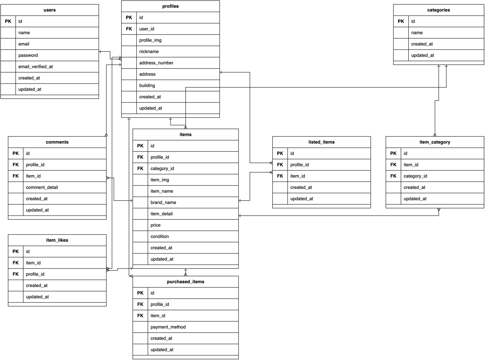

# アプリケーション名：test__frm

## 環境構築：

###git clone git@github.com:mevius-lavita/test__frm.git
###cd test__frm
###cp src/.env.example src/.env

**重要**: `src/.env` ファイルで以下の設定を確認・修正：

env

### DB
DB_HOST=mysql
DB_PORT=3306
DB_DATABASE=laravel_db
DB_USERNAME=root
DB_PASSWORD=root

### メール設定（MailHog）
MAIL_MAILER=smtp
MAIL_HOST=mailhog
MAIL_PORT=1025
MAIL_ENCRYPTION=null
MAIL_FROM_ADDRESS=noreply@example.com

### strip
STRIPE_PUBLIC_KEY=pk_test_51T481dR767t52LNgYhbI11NtbSYS6ma2Ypw4Fe8lsegKeyr4fScSKhctnRguDTGC9P5eDHkK8sGcmZzHNXc1GrdX00wQYRMFNl
STRIPE_WEBHOOK_SECRET=whsec_0af544fbfd903e12120e8f7f9cbd2e41d2ecceae2e3784dde795756453bbe1ad
STRIPE_SECRET=sk_test_51T481dR767t52LNgcbQYBqFqHCFOqZWHwkcCx3C9ZbnWfrO3EZCYPFE0DIrao46J55XiR5HQ9sDbTJs7rxB0JMdV00T3UejPFN

### その他の設定（必要に応じて修正）
APP_NAME=CoachTech
APP_ENV=local
APP_DEBUG=true

(macの場合)docker-compose.yml 
mysql:
  image: mysql:8.0.34

### コンテナのビルドと起動・依存関係のインストール・データベース初期化とシーディング
docker-compose up -d

docker-compose exec php bash 

composer install

php artisan key:generate

php artisan migrate:refresh

php artisan storage:link

php artisan db:seed --force

### mysqlが立ち上がらない場合
#### 1) 旧データを退避
ts=$(date +%Y%m%d_%H%M%S)
mv docker/mysql/data "docker/mysql/data_backup_${ts}"

#### 2) 新規データディレクトリを作成
mkdir -p docker/mysql/data

#### 3) mysql を再起動
docker-compose up -d mysql

#### 4) 起動確認（Up / ready for connections）
docker-compose ps mysql
docker-compose logs --no-color --tail=60 mysql

## テスト用の .env.testing ファイルの設定（必要に応じて）
###cp src/.env.testing.example src/.env.testing 2>/dev/null || true

## 使用技術

### バックエンド
- **Laravel 8.x** - PHPフレームワーク
- **PHP 8.1-fpm** - PHP実行環境
- **MySQL 8.0.34** - リレーショナルデータベース

### フロントエンド
- **Laravel Mix** - アセットバンドラー
- **HTML5/CSS3** - マークアップとスタイリング

### インフラストラクチャ・開発ツール
- **Docker** - コンテナ化プラットフォーム
- **Docker Compose** - マルチコンテナオーケストレーション
- **nginx** - Webサーバー（リバースプロキシ）
- **PHPMyAdmin** - データベース管理ツール（http://localhost:8080）
- **MailHog** - メール送受信テスト用ツール（http://localhost:8025）

### 認証・セキュリティ
- **Laravel Fortify** - 認証フロントエンド
- **Laravel Sanctum** - API認証・SPA認証

### その他のライブラリ
- **Stripe** - 決済処理
- **PHPUnit** - ユニットテスト・機能テスト
- **Composer** - PHPパッケージマネージャー

## ER図

## URL：

セットアップが完了したら、以下のURLでアプリケーションにアクセス可能：
| サービス | URL | 説明 |
|---------|-----|------|
| アプリケーション | http://localhost | 商品一覧画面 |
| アプリケーション | http://localhost/register | 会員登録画面 |
| PHPMyAdmin | http://localhost:8080 | データベース管理ツール |
| MailHog | http://localhost:8025 | メール受信確認（テスト用） |
